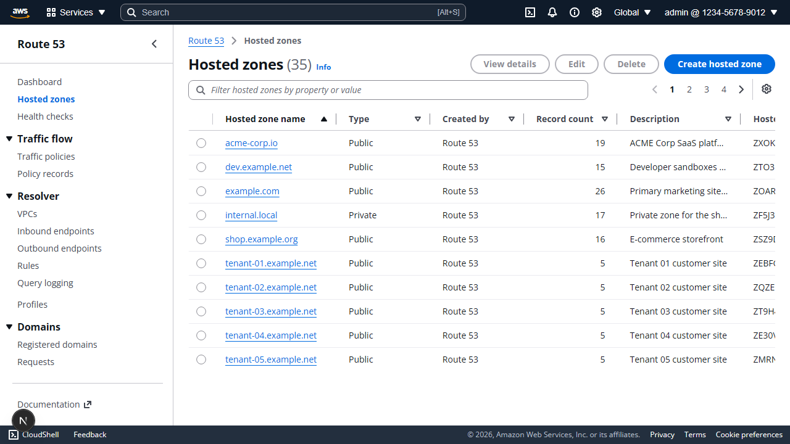
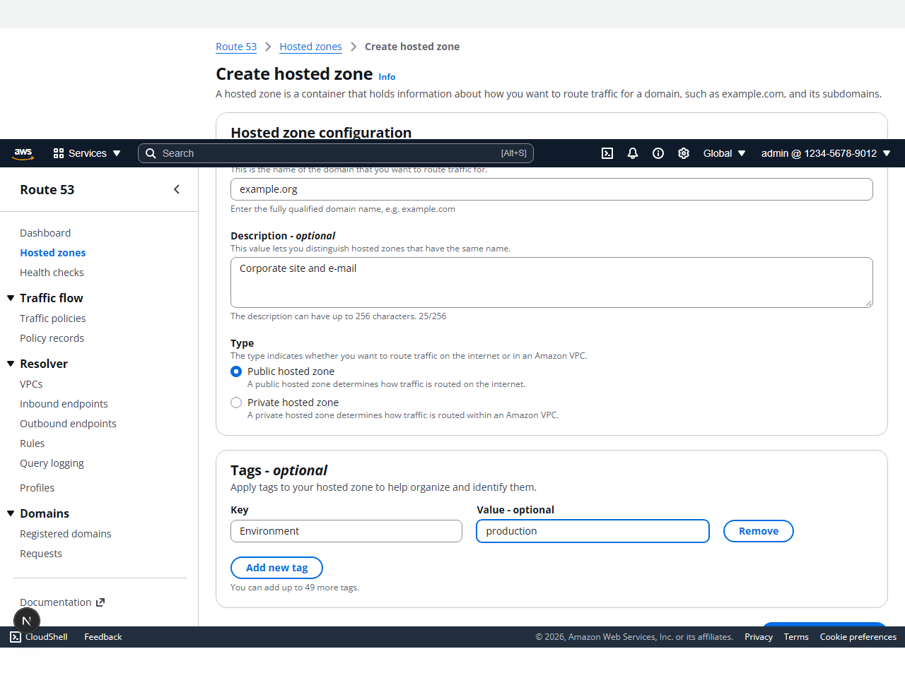
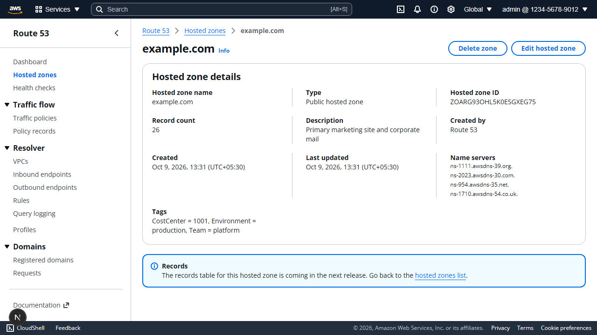
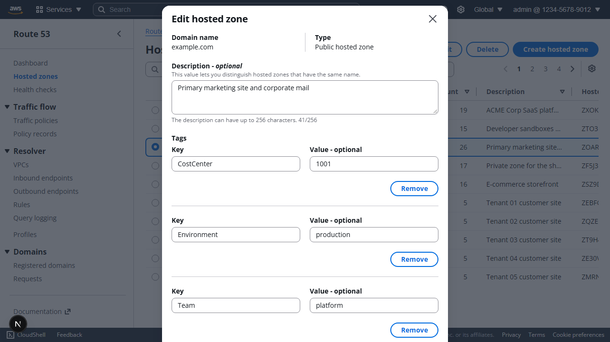
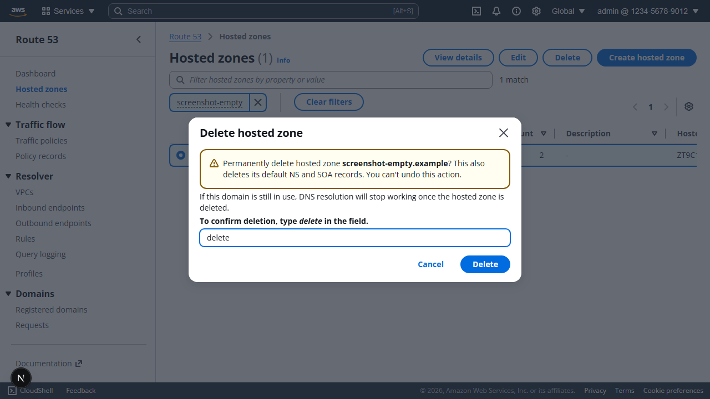
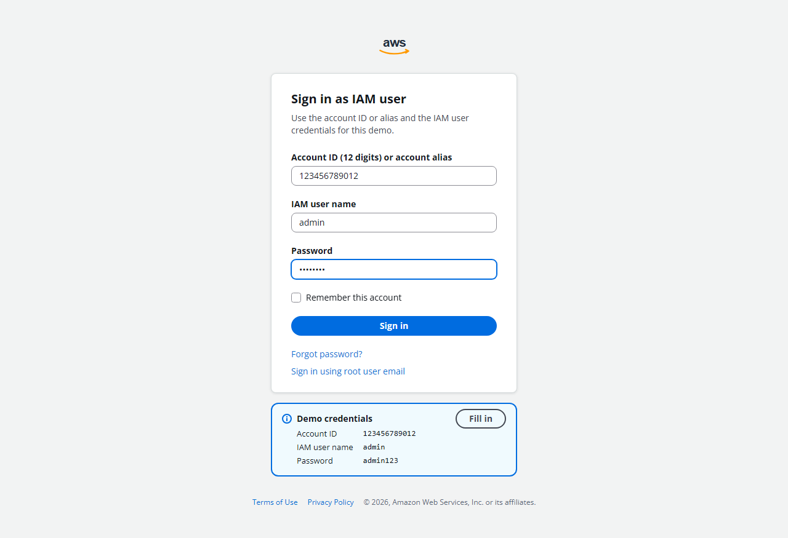
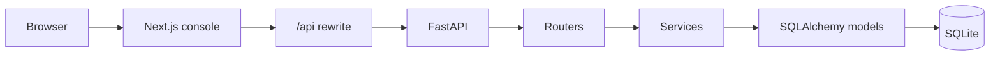
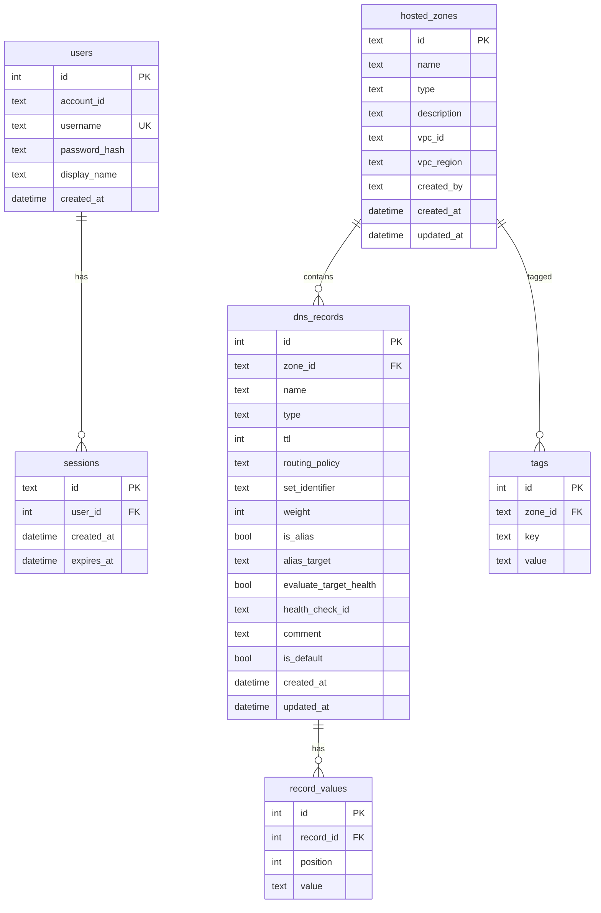

# AWS Route 53 Clone

A working clone of the AWS Route 53 console. You can sign in, manage hosted zones and DNS records, and the data stays in SQLite. DNS is not served to the public internet. The app recreates the console workflows: navigation, tables, forms, filters, pagination, modals and flash messages.

**Live demo:** https://frontend-lyart-two-57.vercel.app

**API docs:** https://route53-clone-api-production-2895.up.railway.app/docs

**Demo credentials**

| Field | Value |
| --- | --- |
| Account ID | `123456789012` |
| IAM username | `admin` |
| Password | `admin123` |

The same values are on the sign-in page hint.

## Screenshots

Shots already captured from the console. Record-form and import screenshots are added in the final pass.













More: [filtered list](docs/screenshots/zones-list-filtered.png), [no matches](docs/screenshots/zones-no-match.png), [empty](docs/screenshots/zones-empty.png), [error](docs/screenshots/zones-error.png), [private zone form](docs/screenshots/zone-create-private.png), [duplicate name](docs/screenshots/zone-create-duplicate-error.png), [delete blocked](docs/screenshots/zone-delete-blocked.png), [light shell](docs/screenshots/shell-light.png), [dark shell](docs/screenshots/shell-dark.png), [dark list](docs/screenshots/zones-list-dark.png).

## Features

Mapped to [docs/ASSIGNMENT.md](docs/ASSIGNMENT.md).

### Authentication

- [x] Login
- [x] Logout
- [x] Session persistence across refresh
- [x] IAM, accounts, organizations and billing are mocked

### Hosted zones

- [x] View hosted zones
- [x] Search hosted zones
- [x] Create hosted zones (public and private)
- [x] Edit hosted zones (description and tags)
- [x] Delete hosted zones (typed confirmation, blocked when non-default records exist)
- [x] All zone data persists in SQLite

### DNS records

- [x] A, AAAA, CNAME, TXT, MX, NS, PTR, SRV, CAA
- [x] View records
- [x] Search records
- [x] Create records, including several in one submit
- [x] Edit records
- [x] Delete records, including bulk delete
- [x] All record data persists in SQLite

### Route 53 experience

- [x] Navigation structure
- [x] Hosted zone management
- [x] DNS record management
- [x] Tables
- [x] Forms
- [x] Search
- [x] Filters
- [x] Pagination
- [x] Modals
- [x] Notifications

### Mocked sections

- [x] Dashboard
- [x] Traffic policies and policy records
- [x] Health checks
- [x] Resolver pages
- [x] Profiles
- [x] Domain pages

Each of those routes uses one Coming Soon page with a link back to Hosted zones.

### Bonus

- [x] Import DNS records from a BIND zone file (parse preview, then confirm)
- [ ] Export a hosted zone as JSON or BIND (API exists; console dropdown is next)
- [x] Dark mode toggle, persisted
- [ ] Keyboard shortcuts (specified below, not wired yet)
- [x] Bulk delete of records (zones list is still single-select)

## Tech stack

| Layer | Choice |
| --- | --- |
| Frontend | Next.js 15 (App Router), TypeScript (strict, no `any`), React 19 |
| UI | Cloudscape Design System |
| Data fetching | TanStack Query |
| Backend | FastAPI, Pydantic v2 |
| ORM | SQLAlchemy 2 |
| Database | SQLite |
| Zone files | dnspython |
| Frontend tests | Vitest, Testing Library, Playwright |
| Backend tests | pytest, Ruff |
| Hosting | Vercel (frontend), Railway (API) |

## Setup

Prerequisites: Node.js 20+, Python 3.11+ (3.12 or 3.13 in CI).

### Backend

```powershell
cd backend
python -m venv .venv
.\.venv\Scripts\Activate.ps1
pip install -r requirements.txt
copy .env.example .env
uvicorn app.main:app --reload --port 8000
```

On macOS or Linux, activate with `source .venv/bin/activate`.

The API creates tables on startup and seeds the demo user plus showcase zones when the database is empty. To also seed the 30 extra zones used for pagination:

```powershell
$env:SEED_MANY = "true"
uvicorn app.main:app --reload --port 8000
```

Or seed an existing empty database by hand:

```powershell
python -m app.seed --many
```

### Frontend

```powershell
cd frontend
npm install
copy .env.example .env.local
npm run dev
```

Open http://localhost:3000. The Next.js server proxies `/api/*` to `API_URL` (default `http://localhost:8000`), so the session cookie stays on the frontend origin.

### Environment variables

Backend (`backend/.env.example`):

| Variable | Local default | Production |
| --- | --- | --- |
| `DATABASE_URL` | `sqlite:///./route53.db` | `sqlite:////data/route53.db` on the Railway volume |
| `SECRET_KEY` | `change-me-in-production` | random secret, set only in the host |
| `COOKIE_SECURE` | `false` | `true` |
| `ALLOWED_ORIGINS` | `["http://localhost:3000"]` | the Vercel origin |
| `SEED_ON_STARTUP` | `true` | `true` |
| `SEED_MANY` | `false` | `true` on the demo |

Frontend (`frontend/.env.example`):

| Variable | Purpose |
| --- | --- |
| `API_URL` | Backend origin used by the Next.js rewrite. Not a public browser URL. |

No secrets are committed. `.env` files are gitignored.

### Tests

```powershell
cd backend
.\.venv\Scripts\python -m pytest --cov
cd ..\frontend
npm test
npm run typecheck
npm run lint
npm run format:check
npx playwright test
```

Playwright expects the backend on port 8000 with `SEED_MANY=true` and a production `next start` (CI builds first). Locally it reuses a server that is already listening. Use one Playwright worker. Two workers share one SQLite file, and the zones cleanup deletes in-use `*.e2e-test.com` zones.

### Docker

Docker Compose runs both services. The API data is stored in a named volume.

```powershell
docker compose up --build
```

Frontend: http://localhost:3000. API: http://localhost:8000/docs.

## Architecture



The browser only talks to Next.js. `next.config.mjs` rewrites `/api/:path*` to the FastAPI origin, so `Set-Cookie` is first-party. Routers validate HTTP and call services. Services hold the rules (`validators.py`, `domain.py`, `record_service.py`, `zone_service.py`, `bind_io.py`). Models are the tables.

### Auth flow

1. The sign-in form posts account id, username and password to `POST /api/auth/login`.
2. The service checks the bcrypt hash and inserts a row in `sessions`. The row id is a random token.
3. The response sets an HttpOnly `session` cookie (`SameSite=Lax`, `Secure` when `COOKIE_SECURE=true`) for seven days.
4. Later requests send the cookie. The dependency loads the session, rejects it when it is missing or expired, and returns the user.
5. Logout deletes the session row and clears the cookie.
6. A refresh keeps the cookie, so the console stays signed in. A bad cookie is treated as signed out and the UI returns to `/login`.

## Database schema



Zone ids look like AWS ids (`Z` plus 20 letters and digits). Names are stored lowercase with a trailing dot. `(name, type)` is unique, so `example.com` can exist once as public and once as private. Record values are their own rows so a multi-value A or TXT record stays queryable and ordered. Deletes cascade from zone to records, values and tags. `record_count` is `COUNT(*)` at read time, not a stored column. List queries use indexes on zone name and on `(zone_id, type)` / `(zone_id, name)`.

## API overview

Every route below is under `/api` and, except health and login, requires the session cookie. Interactive docs: [/docs](https://route53-clone-api-production-2895.up.railway.app/docs) on the deployed API, or http://localhost:8000/docs locally.

| Method | Path | Purpose |
| --- | --- | --- |
| GET | `/api/health` | Liveness, no auth |
| POST | `/api/auth/login` | Sign in, set cookie |
| POST | `/api/auth/logout` | Sign out |
| GET | `/api/auth/me` | Current user |
| GET | `/api/hostedzones` | List, filter, sort, paginate |
| POST | `/api/hostedzones` | Create a zone and its default NS and SOA |
| GET | `/api/hostedzones/{id}` | Zone detail, tags, name servers, record count |
| PUT | `/api/hostedzones/{id}` | Update description and tags |
| PUT | `/api/hostedzones/{id}/tags` | Replace tags |
| DELETE | `/api/hostedzones/{id}` | Delete. `force=true` removes records too |
| GET | `/api/hostedzones/{id}/records` | List records. Filters: `q`, `type`, `routing_policy`, `alias`, `name` |
| POST | `/api/hostedzones/{id}/records` | Create one record or a JSON array |
| GET | `/api/hostedzones/{id}/records/{recordId}` | One record |
| PUT | `/api/hostedzones/{id}/records/{recordId}` | Update a record |
| DELETE | `/api/hostedzones/{id}/records/{recordId}` | Delete one record |
| POST | `/api/hostedzones/{id}/records/bulk-delete` | Delete many. Each id is `deleted`, `skipped` or `not_found` |
| POST | `/api/hostedzones/{id}/import` | BIND file or pasted text. `dry_run=true` previews |
| GET | `/api/hostedzones/{id}/export` | `format=json` or `format=bind` |

Errors are `{ "error": { "code", "message", "fields" } }`.

## Record validation

The browser uses the same rules as `backend/app/services/validators.py`.

| Rule | Behavior |
| --- | --- |
| Name | Must stay inside the zone. A wildcard is only the leftmost label. |
| A | IPv4. Leading zeros are rejected. |
| AAAA | IPv6, stored in Python's canonical form. |
| CNAME | One hostname. Not allowed at the zone apex. Cannot share its name with another record. |
| TXT | Quoted strings, 255 characters each, 4000 total. Unquoted text is quoted and split. |
| MX | Priority 0–65535 and a hostname. |
| NS, PTR | Hostnames. |
| SRV | Priority, weight, port and a target. |
| CAA | Flags, a known tag, and a value. |
| TTL | Integer 0–2147483647. Empty becomes 300. Alias records have no TTL. |
| Values | At most 100. Duplicates after normalization are rejected. |
| Alias | Only A, AAAA and CNAME. Requires a target hostname and no values. |
| Weighted | Set id required. Weight 0–255. |
| Other policies | Latency, failover, geolocation and multivalue store a set id. |
| Comment | At most 256 characters. Blank becomes null. |
| Default NS and SOA | Only TTL, values and comment can change. They cannot be deleted. |

## Keyboard shortcuts

Not active in the UI yet. The intended set:

| Keys | Action |
| --- | --- |
| `/` | Focus the filter |
| `c` | Create a zone on the list, or a record on a zone |
| `g` then `h` | Go to Hosted zones |
| `?` | Open the shortcuts help modal |
| `Esc` | Close a modal or the help dialog |

They will be ignored while typing in a field, and ignored while a modal is open except `Esc`.

## Design decisions

- Cloudscape is the AWS console component set, so tables, forms and navigation match Route 53 without a custom design system.
- The session is a server-side row plus an HttpOnly cookie. The token is not stored in `localStorage`.
- The Next.js rewrite keeps the cookie on the site the user opened. The browser never calls the API host directly.
- `record_count` is computed so it cannot drift from the rows.
- A hosted zone name and type cannot be edited after create, matching Route 53.
- Routing details that have no column (region, failover, location) are packed into `set_identifier` so they round-trip without a schema change.
- SQLite is one file, which is enough for this clone. A Railway volume keeps that file across deploys. If the volume is unavailable, startup seeding rebuilds the demo data and that is called out here.
- Tests run in GitHub Actions on every push to `main`: Ruff, pytest on Python 3.12 and 3.13, Prettier, ESLint, `tsc`, Vitest, `next build`, and Playwright.

## Testing

Counts from the latest local and CI runs:

| Suite | Count |
| --- | --- |
| Backend pytest | 268 |
| Frontend Vitest | 164 |
| Playwright | 41 |

Playwright covers sign-in, the shell, hosted zones, and record create, edit, delete, filter, import and tags. Screenshot capture is opt-in (`SCREENSHOTS=1`) and is not part of the 41.

## Project structure

```
backend/app
  routers/        HTTP only
  services/       validation and use cases
  models/         SQLAlchemy tables
  schemas/        Pydantic request and response models
  seed.py         demo user and zones
frontend
  app/            App Router pages
  components/     Cloudscape screens
  hooks/          one module per resource
  lib/            API client, validators, constants
  e2e/            Playwright
docs/             assignment, guide, screenshots, progress
```

## Known limitations

- The app does not answer real DNS queries or call AWS.
- Export is implemented on the API and not yet as a console dropdown.
- Keyboard shortcuts and the density toggle are not wired.
- The zones table selects one row. Record bulk delete is implemented.
- Latency, failover and geolocation fields are stored inside the set id.
- Query logging, test record and DNSSEC signing are mocked.
- Two Playwright workers against one SQLite file race. CI and local runs use one worker.
- The Railway disk is a volume at `/data`. A redeploy without that volume would start from the seed again.

## Future work

- JSON and BIND export from the zone page.
- Keyboard shortcuts and a comfortable/compact density toggle.
- Multi-select delete on the hosted zones list.
- Another screenshot pass for the record screens.
- Alembic migrations if the schema needs to change in place.
